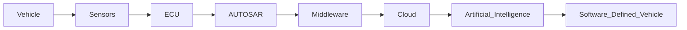

<div align="center">


<br>

[](https://www.linkedin.com/in/aruvib)
[](https://aruvi-b.github.io/me/)
[](https://www.kaggle.com/aruvib)
[](mailto:aruvibalamurugan@gmail.com)

<br>


</div>

---

# 👋 About Me

```yaml
Name:
  Aruvi B

Role:
  Research Engineer

Organization:
  CreamCollar

Specialization:
  - Software Defined Vehicles (SDV)
  - Embedded Systems
  - Automotive Artificial Intelligence
  - AUTOSAR
  - Vehicle Architecture

Current Focus:
  - AI-powered Engineering Tools
  - Automotive Product Research
  - Embedded Linux
  - OTA Platforms
  - SDV Toolchains
  - Agentic AI

Mission:
  Engineering intelligent software that powers the next generation of vehicles.

Location:
  Salem, Tamil Nadu, India 🇮🇳
```

> I enjoy building intelligent engineering tools that bridge **automotive electronics**, **embedded software**, and **artificial intelligence**. My work focuses on accelerating Software Defined Vehicle development through automation, research, and open-source innovation.

---

# 🚗 SDV Engineering Landscape



---

# 🔬 Research Interests

- Software Defined Vehicles
- Embedded Systems
- AUTOSAR Classic Platform
- Embedded Linux
- OTA Updates
- Connected Vehicles
- Functional Safety
- AI for Automotive Engineering
- Vehicle Diagnostics
- Digital Twin
- Chassis Intelligence
- Automotive Cybersecurity

---

# 🚀 Current Focus

| Area | Status |
|------|--------|
| AI-powered SDV Engineering | 🟢 Active |
| Product Definition Framework | 🟢 Active |
| AUTOSAR Automation | 🟢 Active |
| Automotive Research | 🟢 Active |
| Embedded Linux | 🟢 Active |
| Open Source Development | 🟢 Active |

---

# 💼 What I Do

| Research | Engineering |
|-----------|-------------|
| Automotive Technology Research | Embedded Software Development |
| Software Defined Vehicles | AI-powered Engineering Tools |
| Automotive AI | Cloud Connected ECUs |
| Product Definition | AUTOSAR Automation |
| Technology Workshops | Proof of Concepts |

---

# 🛠 Technology Stack

## Programming Languages


---

## Embedded Systems


---

## Automotive


---

## AI & Cloud


---

## Engineering Tools


---

# 🌟 Featured Projects

### ⚙️ AUTOSAR MCAL Generator

- Automatic AUTOSAR MCAL Configuration Generation
- Supports DIO, ADC, CAN, GPT, SPI and WDG
- Python + AUTOSAR + Embedded C

🔗 https://github.com/Aruvi-B/AUTOSAR-MCAL-Generator

---

### 🚲 Cranky Bicycle Design

- SAE INDIA Dynamic Performance Award
- Sustainable Product Design
- CATIA Engineering

🔗 https://github.com/Aruvi-B/cranky

---

### 🏥 CareWay

- Smart Hospital Navigation
- Multiple Hackathon Winner

🔗 https://github.com/Aruvi-B/Careway

---

### 🤖 Machine Learning Projects

- Classification
- Regression
- Clustering
- Automotive Data Analytics

🔗 https://github.com/Aruvi-B/Machine-Learning

---

# 🤝 Let's Connect

<div align="center">

| Platform | Link |
|----------|------|
| 💼 LinkedIn | https://linkedin.com/in/aruvib |
| 🌐 Portfolio | https://aruvi-b.github.io/me |
| 📊 Kaggle | https://kaggle.com/aruvib |
| 📝 Blog | https://autonomousinai.blogspot.com |
| 📧 Email | aruvibalamurugan@gmail.com |

</div>

---

<div align="center">


### ⭐ Engineering the Future of Software Defined Vehicles ⭐

*"Building intelligent software, advancing automotive research, and creating open-source technologies that shape the next generation of mobility."*

</div>
